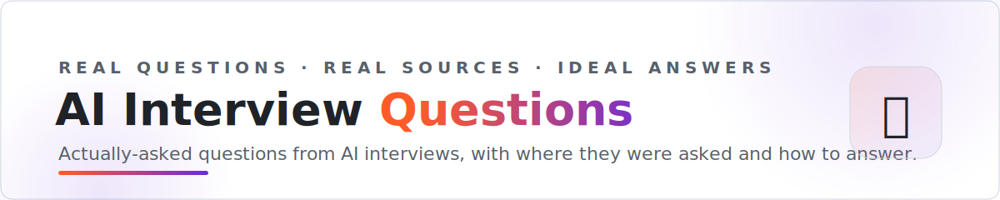

<picture>
  <source media="(prefers-color-scheme: dark)" srcset="assets/banner-dark.svg">
  
</picture>

   

**331+ questions actually asked in AI interviews — with where they were asked, what's being tested, and the answer a strong candidate gives.**

No invented "top 50 questions" filler: every entry traces to a public candidate report, and the answers are hidden behind spoilers so you can attempt first.

---

## The banks

| | Bank | What's inside | Questions |
|---|---|---|---:|
| 🧠 | **[LLM & ML Concepts](banks/llm-and-ml-concepts.md)** | Transformers, fine-tuning, RAG, agents, evals, inference, classic ML breadth — the knowledge round. | **62** |
| 💻 | **[Coding & ML System Design](banks/coding-and-system-design.md)** | Implement attention from scratch, build a RAG app, design an LLM serving stack — the hands-on rounds. | **66** |
| 🚀 | **[Frontier AI Labs](banks/frontier-ai-labs.md)** | What OpenAI, Anthropic, DeepMind, xAI, Mistral, Meta and Cohere actually ask, by lab and by round. | **71** |
| 🤝 | **[FDE, AI Product & GTM](banks/fde-product-and-gtm.md)** | Decomposition cases, customer scenarios, product sense and GTM engineering — the customer-facing loops. | **66** |
| 📊 | **[Data & Applied Science](banks/data-and-applied-science.md)** | ML breadth/depth, experimentation, applied LLM and science presentations — Amazon AS loops and beyond. | **66** |

## ⭐ Start with these 10

The marquee questions — a mix of the most-asked and the most-distinctive. Each links straight into the bank, answer hidden behind a spoiler so you can attempt it first.

- **[The mission-contradiction test](banks/frontier-ai-labs.md#6-the-mission-contradiction-test)** — Anthropic's values round — the #1 documented reason strong candidates get rejected
- **[Debug a transformer with 4 failing tests, then train a classifier](banks/coding-and-system-design.md#8-debug-a-transformer-with-4-failing-tests-then-train-a-classifier-openai)** — OpenAI's real coding screen, not LeetCode
- **[Reduce airport security wait times](banks/fde-product-and-gtm.md#2-reduce-airport-security-wait-times)** — The Palantir decomposition round, worked end to end
- **[What is a KV cache and how does it speed up inference?](banks/llm-and-ml-concepts.md#5-what-is-kv-cache-and-how-does-it-speed-up-inference)** — Asked everywhere; most candidates fumble the memory math
- **[Implement FlashAttention-style tiled attention](banks/coding-and-system-design.md#5-implement-flashattention-style-tiled-attention)** — Mistral / infra-lab favorite
- **[Walk me through your favorite paper](banks/frontier-ai-labs.md#4-walk-me-through-your-favorite-paper)** — The research-taste round, and how it's actually graded
- **[Metric choice for a 0.1%-positive fraud model](banks/data-and-applied-science.md#5-metric-choice-for-a-01-positive-fraud-model)** — The Amazon Applied Scientist breadth trap
- **[DPO vs RLHF/PPO — when would you pick each?](banks/llm-and-ml-concepts.md#14-dpo-vs-rlhfppo-when-would-you-pick-each)** — Post-training's most-asked comparison
- **[The deployment slipped three weeks — tell the customer's CTO](banks/fde-product-and-gtm.md#8-the-deployment-slipped-by-three-weeks-tell-the-customers-cto)** — The customer-scenario round FDEs live or die on
- **[Transformer vs gradient-boosted trees on tabular data](banks/data-and-applied-science.md#12-transformer-vs-gradient-boosted-trees-on-tabular-data)** — The depth probe that separates real practitioners

## How to use this repo

1. **Pick the bank for your next round** — knowledge screen → Concepts; practical → Coding & Design; a specific lab → Frontier Labs.
2. **Attempt before opening the 💡 spoiler.** Saying an answer out loud beats reading ten of them.
3. **Chase the sources.** Each question links to the original report — the surrounding thread often has grading detail we couldn't fit.

## ➕ Add a question you were asked

Interviewed recently? The best questions come from people fresh out of the loop. [Open an "Add a question" issue →](https://github.com/landedjobs/ai-interview-questions/issues/new?template=add-question.yml) with the question, where it was asked, and a source if you have one — or open a PR editing the relevant bank. See [CONTRIBUTING.md](CONTRIBUTING.md).

## Related

- 📘 [ai-interview-guides](https://github.com/landedjobs/ai-interview-guides) — company-by-company loops, comp, and rejection patterns
- 🧭 [awesome-ai-native-jobs](https://github.com/landedjobs/awesome-ai-native-jobs) — the umbrella for the whole family
- 🚀 [ai-engineer-jobs](https://github.com/landedjobs/ai-engineer-jobs) — 300 live AI engineer roles, auto-updated

---

**Practice these out loud. [Landed](https://landed.jobs) runs voice mock interviews that grill you on exactly these questions — plus daily matched AI roles and agent-drafted application answers.**

Every question traces to a public candidate report — sources inline in each bank. Asked something new recently? PRs welcome. · maintained by <a href="https://landed.jobs">Landed</a>

